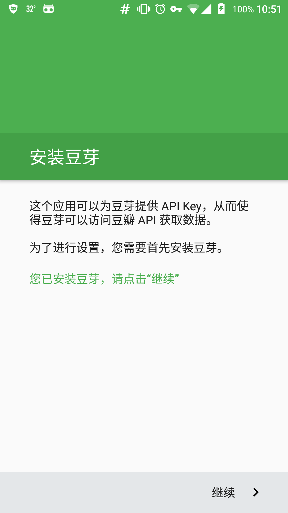
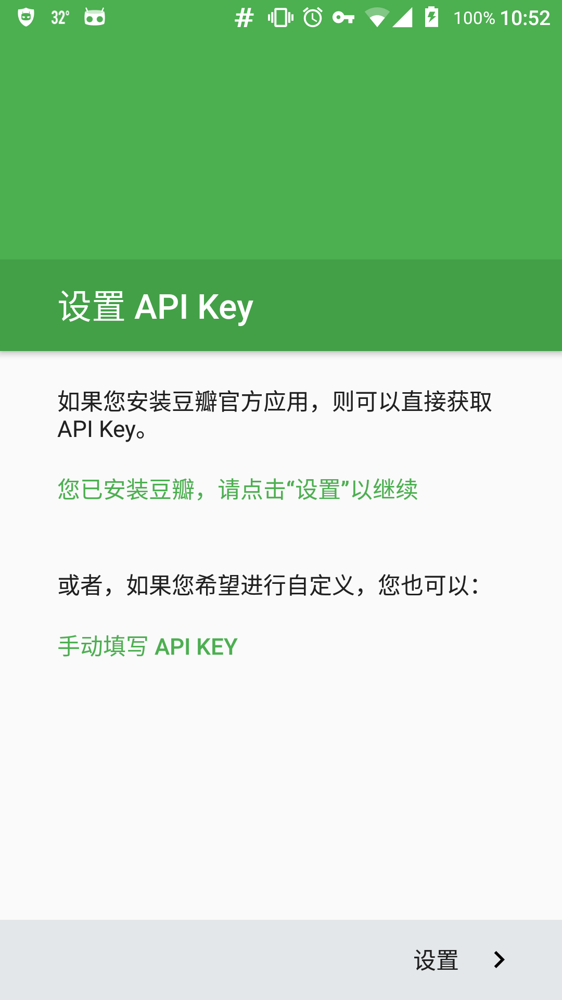
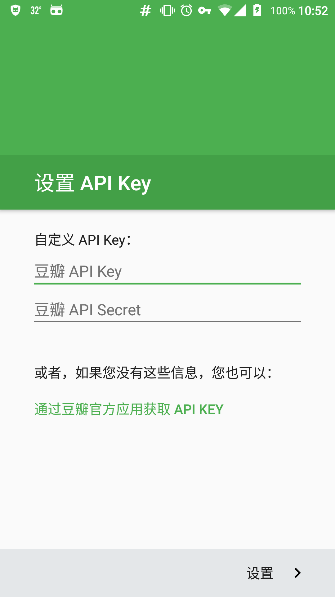

# 豆芽 API Key 设置向导

本应用可以为[豆芽](https://github.com/DreaminginCodeZH/Douya)设置 API Key。


## 预览

<p>


</p>

## 获取

*目前豆芽 1.0.0-alpha.2 尚未发布，因此除非您手动构建豆芽，本应用暂时无法使用。*

请在 [Release](https://github.com/DreaminginCodeZH/DouyaApiKey/releases/latest) 中下载并安装应用。

暂时没有内置的更新渠道，请关注本项目的 Release。

## 许可证

```
Copyright 2016 Zhang Hai

Licensed under the Apache License, Version 2.0 (the "License");
you may not use this file except in compliance with the License.
You may obtain a copy of the License at

   http://www.apache.org/licenses/LICENSE-2.0

Unless required by applicable law or agreed to in writing, software
distributed under the License is distributed on an "AS IS" BASIS,
WITHOUT WARRANTIES OR CONDITIONS OF ANY KIND, either express or implied.
See the License for the specific language governing permissions and
limitations under the License.
```
